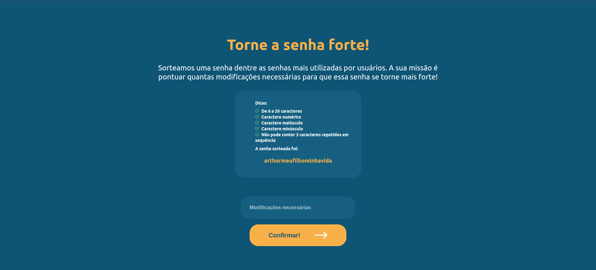
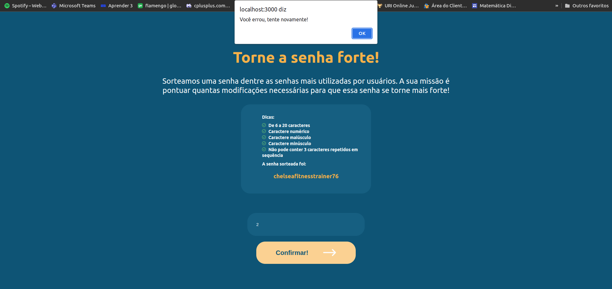
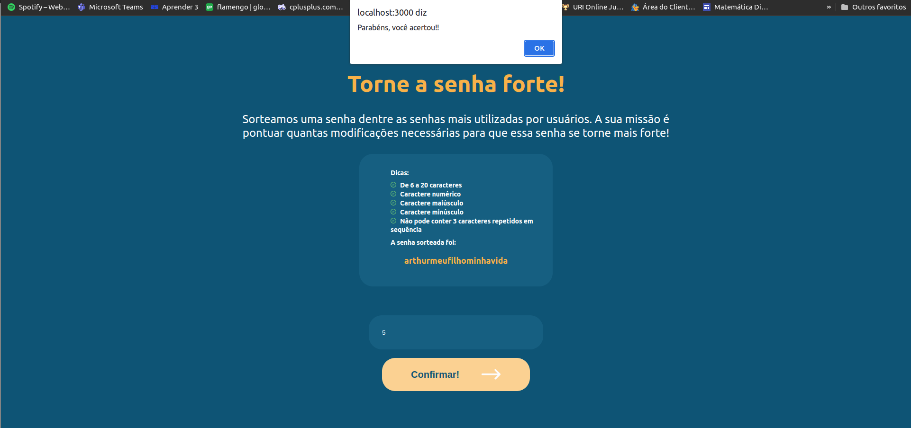

# Greed - Senha forte

**Conteúdo da Disciplina**: Greed 

## Alunos
|Matrícula | Aluno |
| -- | -- |
| 15/0005563  |  André Lucas Ferreira |
| 17/0039803	  |  Lucas Medeiros |

## Sobre 

A ideia do projeto é criar um jogo com as senhas mais comuns utilizadas na internet, onde o objetivo do jogador é definir a quantidade mínima de modificações necessárias para transformar um senha fraca em uma senha forte.

Uma senha forte é definida pelos seguintes critérios:

- No mínimo 6 caracteres e no máximo 20 caracteres;
- Possuir uma letra maiúscula;
- Possuir uma letra minúscula;
- Possuir um número.
- Não possuir três dígitos iguais consecutivos

As possíveis operações para modificar a senha são:

- Remover um caractere;
- Adicionar um caractere;
- Substituir um caractere por outro;

**Segue o vídeo de apresentação: [Senha Forte](./apresentacao/Greed-lucas-andre.mp4)**

## Screenshots

## Instalação 
**Linguagem**: JavaScript, HTML, CSS  
**Framework**: React  

## Instalação 

Para clonar o projeto digite:

    git clone https://github.com/projeto-de-algoritmos/Greed_StrongPassword.git

Depois rode o comando para executar o docker da aplicação:

    docker-compose up

Por fim, acesse a porta do frontend e aproveite:

    http://localhost:3000/

## Uso 

1. Abra o navegador web de sua escolha e digite a url do projeto; 
2. Tente descobrir a quantidade mínima de modificações para tornar a senha forte e submeta a resposta
